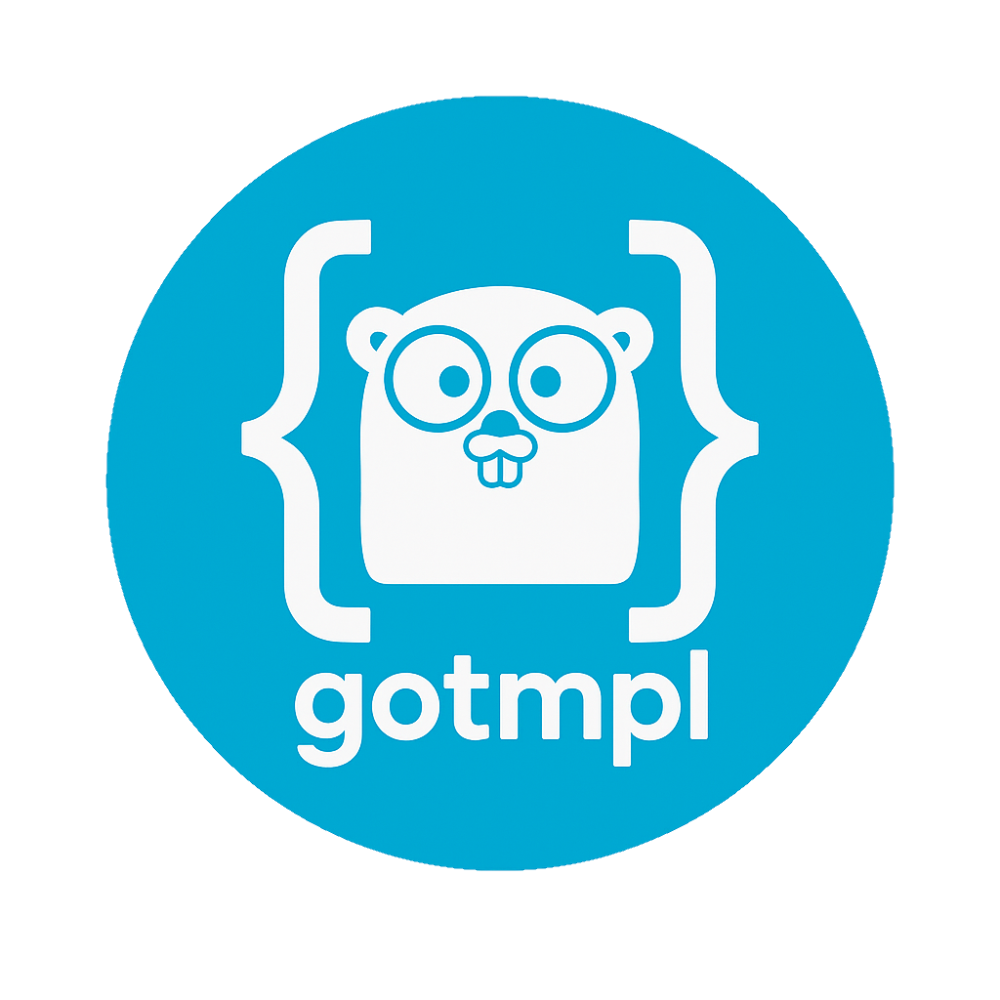

  
   
  <em>Minimal, zero-dependency CLI tool to utilize the power of Go templates in your configuration files.</em>

  
  &nbsp
  
  &nbsp
  

  
  &nbsp
  
  &nbsp
  

  
  &nbsp
  
  &nbsp
  

 

## Documentation

TODO

## Changelog

Check out the latest improvements in our [release notes][changelog].

## Contributing

Before creating your changes please read through our [contributing guidelines][contributing] to learn about our submission process, coding rules, and more.

 

  :star: Love the tool? Give this repo a star :star:

[changelog]: CHANGELOG.md
[contributing]: CONTRIBUTING.md
